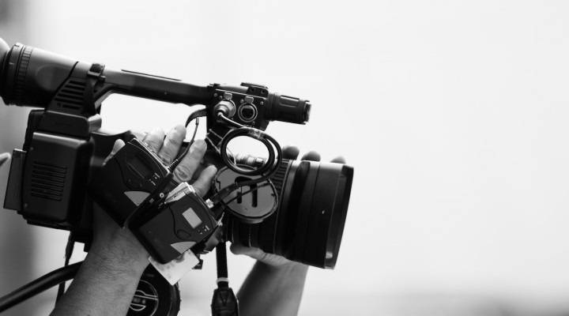
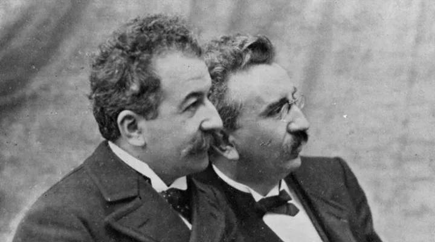
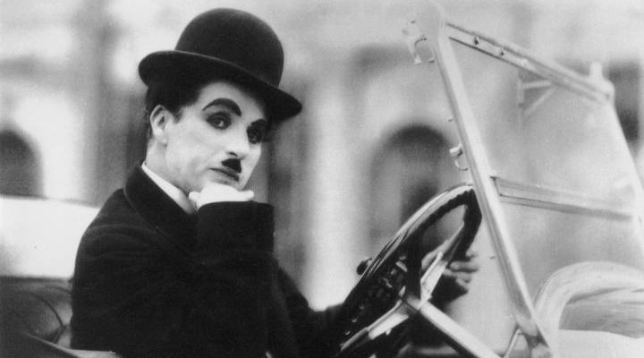
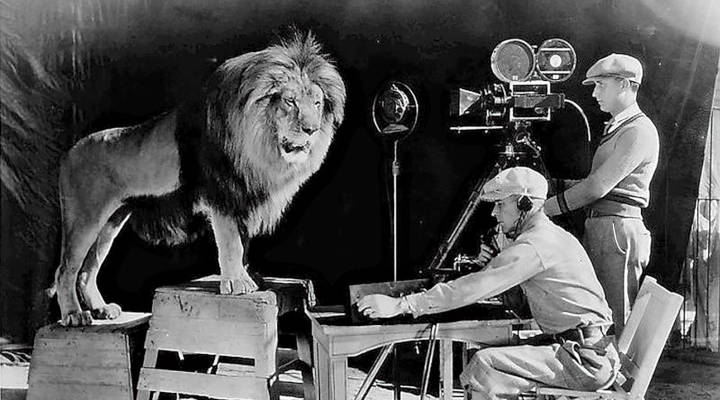
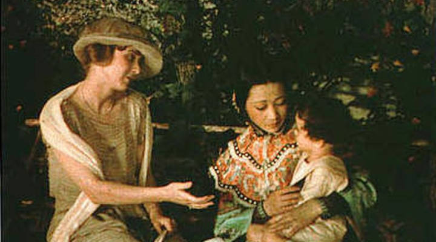
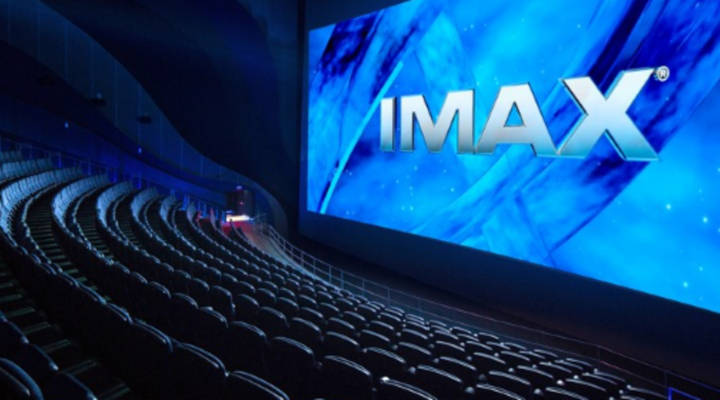
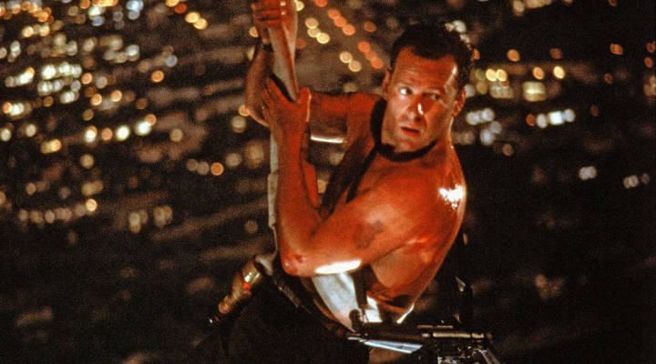
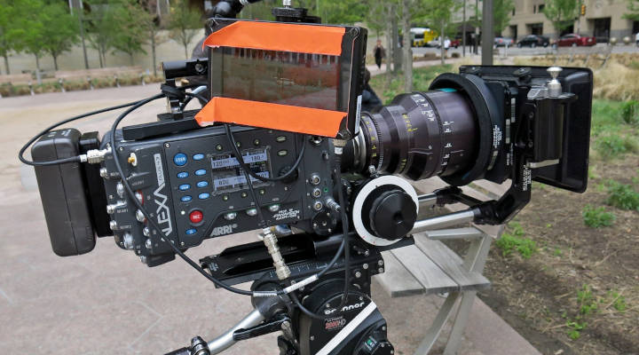

**Кинематограф** *(от греч. κινημα, род. п. κινηματος — движение и греч. γραφω — писать, рисовать; то есть «записывающий движение»)* – отрасль человеческой деятельности, заключающаяся в создании движущихся изображений. Иногда также упоминается как синематограф (от фр. cinématographe, устар.) и кинематография. Название заимствовано у одноимённого аппарата, изобретённого братьями Люмьер, и положившего начало коммерческому использованию технологии. Кинематограф был изобретён в конце XIX века и стал крайне популярен в XX веке.

Кинематограф занимает значительную часть современной культуры многих стран. Во многих странах киноиндустрия является значимой отраслью экономики. Производство кинофильмов сосредоточено на киностудиях. Фильмы демонстрируются в кинотеатрах, по телевидению, распространяются «на видео» в форме видеокассет и видеодисков, а с появлением скоростного интернета стало доступным скачивание кинофильмов в форме видеофайлов на специализированных сайтах или посредством пиринговых сетей, а также просмотр онлайн (что может нарушать права правообладателей кинофильма).

***Навигация:***
<ul>
	<li><a href="#history">История кинематографа</a></li>
	<li><a href="#genres">Жанры игрового кино</a></li>
	<li><a href="#camera">Современная цифровая кинокамера</a></li>
</ul>

<h4 id="history">История кинематографа</h4>

**1.1. Ранний период формирования кино**

Кинематограф появился благодаря нескольким техническим изобретениям, практически совпавшим по времени: сухому броможелатиновому фотопроцессу с высокой светочувствительностью (1878 год), киноплёнке на гибкой и прочной основе (1889 год), скоростному аппарату хронофотографической съёмки (1891 год) и проектору с таким же быстродействием (1895 год). Первые съёмочные аппараты были сконструированы в 80-х годах XIX века. К ним относятся: «фоторужьё» французского физиолога Жюля Марэ (1882), аппарат французского изобретателя Луи Лепренса (1888), аппарат английских изобретателей У. Фрис-Грина и М. Эванса (1889), аппарат русского фотографа В. А. Дюбюка (1891), «Фоноскоп» французского физиолога Ж. Демени (1892). Однако, большинство из этих устройств были рассчитаны на использование дисковых фотопластинок (фоторужьё Марэ) или светочувствительной фотобумаги, непригодных для массового использования. Гибкая целлулоидная основа для киноплёнки была создана Ганнибалом Гудвином в 1887 году, который первым применил противоскручивающий контрслой из желатины. Джордж Истмен в 1889 году первым наладил массовый выпуск фотоматериалов на гибкой прозрачной подложке из нитроцеллюлозы. Пионерами в создании аппаратов для проекции на экран быстро сменяющихся изображений были: немецкий и русский фотографы О. Анщюц и В. А. Дюбюк, создавшие соответственно в 1891 и 1892 годах проекционные аппараты различной конструкции, но с одинаковым названием — «Тахископ», французский изобретатель Э. Рейно, создавший в 1892 году проектор под названием «Оптический театр», и русские изобретатели И. А. Тимченко и М. Ф. Фрейденберг (1893). В Великобритании свой патент на проектор и кинокамеру оформил Вордсворт Донисторп.

<figure>
    
    <figcaption>Братья Люмьер (Огюст слева, Луи справа на фото)</figcaption>
</figure>

Изобретениями, наиболее приблизившимися к кинематографу по своим техническим характеристикам, являются: «кинетограф» Эдисона (1891), аппарат И. А. Тимченко (1893), «хронофотограф» Ж. Демени (1893), проектор американского изобретателя Ж. А. Ле Роя (1894), проектор «паноптиком» американского изобретателя У. Латама (1895), «плеограф» польского изобретателя К. Прушинского (1894) и др. А уже в 1895—1896 годах были изобретены аппараты, сочетающие в себе все основные элементы кинематографа: во Франции — «синематограф» братьев Л. Люмьер и О. Люмьер (1895) и «хронофотограф» Ж. Демени (1895) и т.д.

**1.2. Период немого кино**

Первые короткометражные фильмы длиной 50 футов (примерно 15 метров или 1,5 минуты демонстрации) были по большей части документальные, однако уже в комедийной инсценировке братьев Люмьер Политый поливальщик отражаются тенденции зарождения игрового кино.

Небольшая длина первых фильмов была обусловлена техническим несовершенством киноаппаратуры, тем не менее, уже к 1900-м годам длина кинокартин увеличилась до 200—300 метров (15-20 минут демонстрации). Совершенствование съёмочной и проекционной техники способствовало дальнейшему увеличению длины фильмов, качественному и количественному увеличению художественных приёмов съёмки, актёрской игры и режиссуры. А широкое распространение и популярность кинематографа обеспечили его экономическую выгодность, что, однако, не могло не сказаться на художественной ценности снимаемых кинокартин. В этот период с усложнением и удлинением сюжета фильмов начинают формироваться жанры кинематографа, оформляется их художественное своеобразие, создаётся специфический для каждого жанра набор изобразительных приёмов.

<figure>
    
    <figcaption>Чарли Чаплин</figcaption>
</figure>

Наивысшего своего расцвета «немое» кино достигает к 20-м годам XX века, когда оно уже вполне оформляется как самостоятельный род искусства, обладающий своими собственными художественными средствами.

**1.3. Появление звука в кино**

Ещё до начала XX века Томас Эдисон пытался синхронизировать «кинетоскоп» c фонографом, но потерпел неудачу. Однако впоследствии Уильям Диксон, соавтор Эдисона, утверждал, что ему уже в 1889 году удалось создать кинетофонограф — прибор, воспроизводивший звук и изображение одновременно. Однако не существует никаких доказательств, подтверждающих его слова.

В ранний период кинематографа звуковое кино пытались создать во множестве стран, но столкнулись с двумя основными проблемами: трудность в синхронизации изображения и звука и недостаточная громкость. Последняя проблема была решена после изобретения усилителя низкой частоты, что произошло лишь в 1912 году, когда киноязык развился настолько, что отсутствие звука уже не воспринималось как серьёзный недостаток. Трудности синхронизации удалось преодолеть использованием общего носителя для изображения и фонограммы, однако получить приемлемое качество фотографической звукозаписи стало возможно лишь к началу 1930-х годов.

<figure>
    
    <figcaption>Звуковая синхронная съёмка рычащего льва для заставки кинокомпании MGM. 1928 год</figcaption>
</figure>

В результате патент на ту систему звукового кинематографа, которая впоследствии совершила звуковую революцию, был получен в 1919 году, но кинокомпании не обратили никакого внимания на возможность кино заговорить, желая избежать удорожания стоимости производства и проката кинофильмов и потери иноязычных рынков. Тем не менее 17 сентября 1922 года в Берлине впервые в мире был показан звуковой фильм.

В 1925 году компания Warner Brothers, находившаяся в тот момент на грани банкротства, вложилась в рискованный звуковой проект. Уже в 1926 году Warner Brothers выпустила несколько звуковых фильмов, состоящих в основном из музыкальных номеров, но особого успеха у зрителей они не имели. Успех пришёл только с фильмом «Певец джаза», в котором кроме музыкальных номеров Эла Джолсона присутствовали и его короткие реплики. 6 октября 1927 года — день премьеры «Певца Джаза» — принято считать днём рождения звукового кино.

**1.4. Появление цветного кино**

Первым сохранившимся цветным фильмом стал короткометражный фильм «Танец Лои Фуллер» (англ. Annabelle Serpentine Dance). Он был снят в чёрно-белом варианте в 1894 году, а в 1895 или в 1896 году был раскрашен вручную (кисточкой раскрашивался каждый кадрик). Первый коммерчески успешный цветной фильм «Путешествие на Луну», созданный Жоржем Мельесом в 1902 году, также был раскрашен вручную.

В 1899 году фотограф Эдвард Рэймонд Тернер запатентовал процесс съёмки цветного кино. По технологии Тернера каждый кадр последовательно снимался через три специальных светофильтра красного, зелёного и синего цветов. В 2012 году сотрудники Национального музея СМИ и технологий в Брадфорде отыскали цветную кинозапись Эдварда Тернера, датированную 1902 годом. Ранее самой старой считалась цветная плёнка 1909 года, созданная по технологии Kinemacolor.

Британская технология «Кинемаколор» (англ. Kinemacolor), изобретённая в 1906 году, была первой в мире системой цветного кинематографа, имевшей коммерческий успех. Однако, по сравнению с фильмами, раскрашенными вручную, она имела недостаток: все цвета создавались путём смешивания не трёх, а только двух основных цветов: красно-оранжевого и сине-зелёного[9]. В этой системе в 1908 году был снят «Визит к морю» (англ. A Visit to the Seaside) — первый цветной фильм, показанный в кинотеатрах, в 1910 году — первый цветной игровой фильм «Шахматист» (англ. Checkmated), в 1911 году — первый цветной полнометражный документальный фильм «Торжественный приём в Дели» (англ. With Our King and Queen Through India).

Первыми полнометражными игровыми цветными фильмами, показанными в кинотеатрах, были «The World, the Flesh and the Devil» (1914) и «Little Lord Fauntleroy» (1914), снятые по технологии «Кинемаколор», «The Gulf Between» (1917), изготовленный по технологии «Техниколор» (англ. Technicolor), и «Cupid Angling» (1918), созданный по технологии Douglass Natural Color process

<figure>
    
    <figcaption>Кадр из первого голливудского цветного фильма «Жертвы моря» (1922)</figcaption>
</figure>

Первый голливудский двухцветный фильм, снятый по технологии «бипак» вышел в 1922 году, он не впечатлил зрителей. Однако последовавшие за ним цветные голливудские фильмы, такие как «Странник пустоты» (1924), получили огромный кассовый успех.

Вслед за бешеной популярностью цветных фильмов в Европе, а затем и в США, наступил период охлаждения интереса к цветным фильмам. Цветные фильмы были более дорогими. Изображение на них было менее чётким. Сочетаниями двух цветов нельзя было изобразить все цвета в природе (требовалось три цвета). Существовали и трёхцветные системы, но в них изображение было ещё хуже, так как в них использовались три объектива, и параллакс между ними приводил к образованию цветной каймы у предметов. Режиссёры «серьёзных» фильмов избегали цветного кинематографа, и все шедевры того времени были чёрно-белыми. Публика воспринимала цветные фильмы как аттракцион. Положение было исправлено после изобретения трёхцветного однокамерного варианта технологии «Technicolor». Впервые эту технику применил Уолт Дисней в 1932 году в короткометражном мультфильме «Цветы и деревья». Первый «полноценно цветной» художественный короткометражный фильм системы «Техниколор» под названием «La Cucaracha» вышел в 1934 году.

Первый же полнометражный цветной фильм «Бекки Шарп» американского режиссёра Рубена Мамуляна вышел в 1935, этот год и принято считать годом появления цветного кино.

Хотя система «Техниколор» (и её советский аналог ЦКС-1) была однокамерной, но показ в кинотеатрах производился с трёх кинопроекторов, что налагало большие требования к квалификации и аккуратности киномехаников. Неточная настройка приводила к двоению или троению изображения. Неодновременность включения проекторов приводила к рассинхронизации изображений разных цветов. Избавить от этих недостатков смогла технология многослойных киноплёнок. Первым таким фотоматериалом стала плёнка «Гаспарколор», выпущенная в 1933 году по патенту венгерского учёного Бела Гаспара. В 1935 году Kodak представил первую многослойную киноплёнку, пригодную для фотосъёмки, но для киносъёмки она не годилась. Летом 1937 года немецкая AGFA запустила производство первых в мире хромогенных негативных многослойных киноплёнок, на которые отснят короткометражный игровой фильм «Отзвучит песня» (нем. Ein lied verklingt)[10]. До конца Второй Мировой войны немецкие цветные плёнки не экспортировались и использовались только немецкой государственной киностудией UFA под контролем министерства пропаганды Германии[11]. После победы над Германией союзники получили доступ к технологиям Agfa. В Голливуде производство многослойных киноплёнок по немецкой технологии началось в 1949 году. Многослойные киноплёнки вытеснили другие технологии и господствовали в цветном кино вплоть до расцвета цифровых технологий в 2000-х годах.

**1.5. Дальнейший технический прогресс кинематографа**

В 1950-х годах значительную долю рынка стало отбирать у кинематографа широко распространившееся телевещание, и стремление привлечь зрителя высоким качеством кинопоказа завело технический прогресс в кино ещё дальше. Разработка и внедрение магнитной записи и воспроизведения звука, а также создание и освоение новых видов кинематографа (панорамного, стереоскопического, полиэкранного и др.) привели к значительному повышению качества показа фильмов, стали говорить об «эффекте присутствия» зрителя. Впечатление усиливалось стереофоническим воспроизведением звука, позволявшим создавать «пространственную звуковую перспективу» — звук как бы следует за изображением его источника, вызывая иллюзию реальности источника звука.

Для создания стереоскопического изображения необходимо произвести киносъёмку из двух точек, имитирующих два глаза наблюдателя. На экране кинотеатра оба изображения проецируются вместе, и разделяются посредством очков, содержащих цветовые светофильтры или поляризаторы в двух перпендикулярных плоскостях поляризации.

<figure>
    
    <figcaption>IMAX-зал кинотеатра</figcaption>
</figure>

В настоящее же время существуют очень изощрённые системы звукового сопровождения кино. Число отдельных звуковых каналов доходит до 7, а в перспективных системах даже до 24. Разумеется, всё это призвано усилить глубину погружения зрителя в атмосферу просматриваемого фильма. 

<h4 id="genres">Жанры игрового кино</h4>

Группы произведений игрового кино, выделяемые на основе сходных черт их внутреннего строения. 

Жанры игрового кино не имеют четких границ, которые обычно расплывчаты, и различные жанры могут непрерывно переходить один в другой, соединяясь и разделяясь. Каждый жанр, в свою очередь, может разделяться на несколько поджанров. В результате один и тот же фильм можно отнести к нескольким жанровым группам. 

<figure>
    
    <figcaption>"Крепкий орешек" - пример фильма в жанре боевик</figcaption>
</figure>

**Список популярных жанров кино:**

- **Фантастика** – фильмы с представлением различных вымышленных тематик: будущее, вторжение инопланетян, комические путешествия и т.п.
- **Приключения** – группа жанров, которым присуща острая, напряжённая, быстро развёртывающаяся фабула, основанная на событии, нарушающем привычный ход жизни, заключающем в себе потенциальную опасность и побуждающем героя к действию.
- **Фильм-катастрофа** – масштабное изображение глобальных природных, техногенных и других катастроф.
- **Боевик** – приключенческий фильм с многочисленными эпизодами погони, стрельбы, поединков и т. п.
- **Комедия** – основной предмет жанра – явления, относящиеся к эстетической категории комического. Отличительная особенность – изображение жизненных несоответствий, возбуждающих смех зрителей.
- **Детектив** – картина, рассказывающая о расследовании уголовных преступлений, а также о работе разведчиков.
- **Драма** – отражает частную жизнь людей, главная цель показ личности в её драматических отношениях с обществом.
- **Мелодрама** – традиционный драматургический жанр с характерными признаками: острая интрига, идеальный герой, страдающая героиня, коварный злодей, значительная роль случайных или роковых обстоятельств.
- **Триллер** – тип приключенческого фильма, вызывающий у зрителей тревожное ожидание, беспокойство, страх и пр. Акцент смещается на психологические переживания персонажей, связанные с преступлением. В триллере рассказ ведётся с точки зрения жертвы или преступника.
- **Вестерн** – форма приключенческого кино, тематику которого составляют события, связанные с освоением американского Запада во второй половине XIX в.
- **Исторический фильм** – произведение киноискусства, сюжет которого основан на изображении реальных событий и, как правило, реальных персонажей исторического прошлого.
- **Антиутопия** – поджанр фантастики, описывающий государственный или мировой уклад, в котором при изначальном стремлении к идеальному существованию для всех обитателей складываются негативные тенденции развития.
- **Киберпанк** – поджанр фантастики, отражающий упадок человеческой культуры на фоне технологического прогресса в компьютерную эпоху.
- **Фильм ужасов** – тематически обширный и разнообразный круг фильмов, показывающих явления загадочные, анормальные, сверхъестественные с задачей вызвать у зрителей чувство страха.
- **Музыкальный фильм** – кинопроизведение, в котором музыка выполняет важнейшие смысловые и композиционные функции, определяет жанровую и стилистическую характеристику картины.
- **Байопик** – жанр, повествующий о судьбе знаменитой, известной личности на протяжении всей жизни или в наиболее важные драматические её моменты.
- **Трагедия** – драматический жанр, основывающийся на художественном осмыслении острых сущностных проблем человеческого бытия.

<h4 id="camera">Современная цифровая кинокамера</h4>

Цифровая кинокамера – видеокамера высокого разрешения, предназначенная для съёмки кинофильмов по бесплёночной цифровой технологии. Для преобразования света в цифровые видеоданные такие кинокамеры используют ПЗС- или КМОП-матрицы. Цифровая технология фильмопроизводства позволяет обходиться полностью без киноплёнки, от съёмки исходного материала до демонстрации на экране при помощи цифровых кинопроекторов. Кроме того, с полученного такой кинокамерой цифрового фильма возможна печать фильмокопий на киноплёнке при помощи фильм-рекордера и их демонстрация обычным кинопроектором в обычных кинотеатрах, не оснащённых цифровым оборудованием.

Большинство существующих цифровых кинокамер используют киносъёмочные объективы, рассчитанные на работу с киноплёнкой. Поэтому физический размер матриц подбирается таким же, как размеры кадра существующих форматов киноплёнки. Это часто отражается в названии таких кинокамер — например, Phantom 65, что говорит о размере сенсора, соответствующего широкоформатной негативной киноплёнке шириной 65 мм. За редким исключением, цифровая кинокамера не имеет движущихся механизмов, что делает её бесшумной, в отличие от традиционного киносъёмочного аппарата. Это избавляет от необходимости применения специальной шумоизоляции для проведения синхронных киносъёмок. Запись полученного с матрицы изображения производится на внешний рекордер или съёмную твердотельную память большой ёмкости, например, карточки SxS. Визирование и наводка на резкость производятся оператором при помощи электронного видоискателя. Звук с выносных микрофонов или микшера записывается на тот же носитель, что и изображение. Для этого предусматриваются несколько звуковых входов профессиональных стандартов. Камера обязательно оснащается функцией записи временного кода вместе с изображением для последующей синхронизации со звуком, если он записан внешним рекордером, или с изображением других камер при многокамерной съёмке.

    
Источники:

    
<a href="https://ru.wikipedia.org/wiki/Кинематограф">https://ru.wikipedia.org/wiki/Кинематограф</a>

    
<a href="https://ru.wikipedia.org/wiki/Жанры_игрового_кино">https://ru.wikipedia.org/wiki/Жанры_игрового_кино</a>

