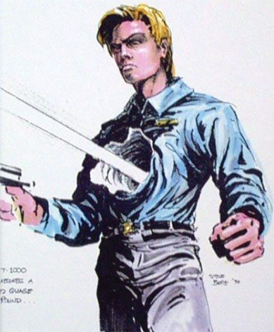
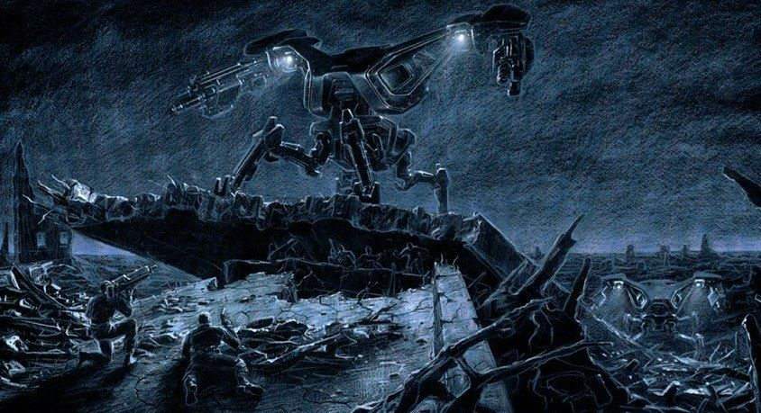

На дворе 1984 год. Сенсация – малобюджетный фильм канадского режиссера с плохоговорящим по-английским австрийским бодибилдером в главной роли, великолепно выступил в прокате, собрав $70 млн. при бюджете в $6 млн. Это означало только одно – будет сиквел. Но все оказалось не так просто.

Кэмерон получил возможность лично снять "Терминатора" только после того, как продал права на фильм Гейл Энн Херд (его будущей супруге) за $1. Она в свою очередь продала половину доли Hemdale Film Corporation. Это помогло Кэмерону снять фильм, но больше с этой студией дел он иметь не хотел, поскольку они считали его фильм второсортным ужастиком и ради экономии хотели вырезать всю концовку, закончив фильм на взрыве бензовоза. Кэмерон не сделал этого и продюсеры не выделила денег на рекламу, считая, что "Терминатор" не взлетит.

Это было не единым препятствием на пути к сиквелу. Кэмерон должен был приступить к съемкам "Aliens" (1986) и не мог начать снимать "Терминатора 2". Тогда режиссер предложил Мартинку Кэмбеллу снять продолжение, но сделка не состоялась: Арнольд Шварценеггер отказался сниматься в "Терминаторе" без Кэмерона.  

Время от времени Кэмерон и его друг Уильям Вишер обсуждали концепты сиквела. Первой идеей было показать войну в будущем. Однако из-за стоимости реализации от нее пришлось отказаться. Была отклонена идея воссоединения Сары Конор и Кайла Риза из-за сходства с "Назад в будущее". Кэмерон также отказался от идеи противостояния Т-800 с женщиной-Терминаторов, чтобы не превратить фильм в комедию.

<figure>
    
    <figcaption>«Терминатор» стал для Джеймса Кэмерона и Арнольда Шварценеггера билетом в высшую лигу</figcaption>
</figure>

Более интересным был вариант противостояния хорошего и плохого Т-800. Один Шварценеггер сыграл бы две роли, но было бы невозможно отличить двух одинаковых терминаторов. Кроме того, антагонист должен быть на порядок сильнее протагониста, иначе зритель не будет болеть за "хорошего", а сделать "злого" Т-800 сильнее и больше, Кэмерон посчитал дорогой к фильму B-категории.   

В 89-м Кэмерон разводиться к Гейл Энн Херд, фильм "Бездна" не оправдывает ожиданий, что убавило интерес Голливуда к канадскому гению. Кэмерону нужно было что-то взрывное, что-то, что вернуло бы ему репутацию.

Тогда в Hemdale начинались финансовые трудности и, узнав об этом, Шварценеггер предложил Марио Кассару и Эндрю Вайне (владельцы студии Carolco) выкупить права на Терминатора. Эти парни любили рисковать по-крупному и всегда покупали материал, за который никто б не взялся и выплачивали актерами баснословные гонорары. "Терминатор" не исключение. Они заплатили $5 млн. Hemdale и Херд, получив все права на фильм.

В ночь перед Рождеством Кассар позвонил Джеймсу Кэмерону и рассказал о сделке, а также спросил, не хочет ли он снять сиквел. Однако, Кэмерон отказался и тогда Марио Кассар предложил ему $6 млн. - по тем временам это был огромный режиссерский гонорар. Кэмерон принял предложение.

Но было одно "НО". Студия назначили премьеру на 3 июля 1991 г. и у Кэмерона было всего 18 месяцев, чтобы создать сиквел.

<figure>
    
    <figcaption>Джеймс Кэмерон на съемочной площадке</figcaption>
</figure>

#### Наброски

Начался мозговой штурм Кэмерона и Вишера. У них была возможность просто взять и повторить сюжет первой части просто добавив размаха, но Джеймс хотел пойти по пути "Чужих" и снять фильм, который продолжил бы идеи первой части, уводя их в другую сторону. 

Фильм в итоге вырос с простой записи Кэмерона на листе: "Молодой Джон Конор и Терминатор, прибывший из будущего, который становиться его другом". Канадский режиссер решил сделать главным героем подростка, который благодаря Терминатору взрослеет, обретает моральные принципы, осознает ценность жизни и учит робота-убийцу, противоречащей всей его сути команды: "Нельзя просто так убивать". Для Кэмерона главной идеей сиквела стало не уничтожение человечества машинами, а то, что люди сами теряеют человечности и становятся похожими на машин.

<figure>
    
    <figcaption>Сценаристу Уильяму Вишеру досталось несколько камео в фильме</figcaption>
</figure>

Кэмерон также отказывался писать сценарий без согласия Линды Хемильтон на участие в фильме. Он не видел новую историю без Сары Конор, которая отбрасывает всю человечность ради убийства Майлза Дайсона. К счастью продюсеров, Хемильтон согласилась на съемки при условии, что ее героиню сделают немного сумасшедшей. 

Следующим важным фактором стал новый злодей – Т-1000. Кэмрон давно придумал робота, который умел бы менять форму и принимать чужой облик. Он стал бы идеальным злодей, который во много раз превосходил бы Т-800. Однако режиссеру нужно было быть на 100% уверенным, что его можно будет показать на экране.  

    <figure>
        
        <figcaption>Концепт T-1000</figcaption>
    </figure>

С этим вопросом Кэмерон обратился к ILM (Industrial Light & Magic) и специалисты по спецэффекта убедили его в том, что это возможно сделать, показав короткий тестовый ролик в котором Т-1000 выходил из пламени.

<figure>
    
    <figcaption>T-1000 - один из первых реалистичных компьютерных персонажей</figcaption>
</figure>

Теперь Кэмерон и Вишер могли приступить к написанию сценария. Однако сроки поджимали и на написание сценария было не больше двух недель, поскольку Carolco хотели представить "Терминатора 2" на Каннском кинофестивале. 

В Кэмерона в запасе был небольшой козырь. Еще на съемках первой части он вырезал несколько сцен с намеком на продолжение:

1. Сара Конор уговаривает Кайла Риза взорвать Cyberdyne Systems для предотвращения войны.
2. Завод на котором был уничтожен первый Т-800 принадлежит той самой Cyberdyne Systems.

Джеймс объединил эти две идеи и создал прочную основу для сюжета. Теперь оставалось успеть к срокам.

#### Сценарий

10 мая 1990 г. в одном из аэропортов Калифорнии уже был готов к взлету самолет, который арендовала студия Carolco. В самолете было больше сотни знаменитостей, собравшихся на Каннский кинофестиваль. Однажды кто-то пошутили, если бы тот самолет разбился, кинопроизводство Голливуда затормозило бы на несколько лет.

Они все ждали только одного человека. Напряжение росло. Мари Кассар нервно посматривал на часы. Наконец к самолету подъехал автомобиль из Джеймсом Кэмероном. Он был не в лучшем состоянии: красные глаза, бледная кожа. Последние 36 часов он непрерывно писал последние 25 страниц сценария. В самолете он отдал сценарий Кассару и Шварценеггеру и немедленно уснул. По приземлению Кассар вынес вердит – фильму быть. Сиквел метился стать самым дорогим фильмом в истории.

<figure>
    
    <figcaption>Раскадровка начальной сцены</figcaption>
</figure>

На бумаге это был почти тот самый "Терминатор 2: Судный день", но ключевое отличие было в расширенной сцене войны в будущем. Изначально она выглядела так: 

    
В грандиозной битве сопротивление побеждает армию Скайнета и захватывает машину времени. Джон Коннор инструктирует Кайла Риза и отправляет его в прошлое, после чего признается остальным, что Кайл его отец. 

    
Саперы собираются взорвать установку, но Коннор останавливает их, говоря, что сперва нужно кое-что сделать. Он спускается в хранилище терминаторов и находит ряд с моделью Т-800, одна из ячеек которого пуста. Джон подходит к следующему роботу и всматривается в отлично знакомое ему лицо. Это тот самый Тереминатор, которого он отправит на защиту самого себя в прошлое.

    
Концепты не снятой первой серии

    

        
        
        
        
        
            
    

Продюсеры решили убрать эту сцену, посчитав ее слишком сложной в производстве. Также из финального сценария были вырезаны и другие сцены:

1. Электрошоковая терапия Сары, во время которой она вспоминала события из первой части.
2. Посещение ранчо Трэвиса Ганта - бывшего любовника Сары, который учил Джона обращаться с оружием. Позже сюда пробирался Т-1000 и уничтожал всех его обитателей.
3. Другая версия сна Сары, в котором ядерные ракеты стартовали с детской площадки и сжигали все вокруг. Сцена была очень дорогой в производстве, поэтому ее заменили на более простой ядерный взрыв.
4. Видение Дайсона. Перед тем, как нажать на детонатор, он видел, как его семья сгорает в ядерном взрыве. Потом тучи расступаются, показывается солнце, и перед Дайсоном появляются улыбающиеся жена и дети. Солнце превращалось в глаз ученого и после его закрытия происходил взрыв.

Даже без этих сцен Терминатор 2 стал самым масштабным фильмом того времени. Изначальный бюджет был $88 млн, потом его увеличили до $102 млн. Сейчас ни одна студия б не выделила такие деньги на фильм с возрастным рейтингом R.

### Джон Коннор и Т-1000

Режиссеру оставалось найти актеров на роли "жидкого металла" и Коннора. Первым претендентом на роль Т-1000 был Майкл Бин, который в первой части исполнил роль Кайла Риза. По задумке Кэмерона, терминатор скопировал облик Риза. Поменять местами героя и злодея было довольно смелой идеей, но в в итоге Кэмерон отказался от этой идеи, чтобы не путать зрителей. 

Дальше на роль предполагался Билли Айдол. Режиссер даже сделал раскадровки с его внешность. Но Айдол попал в аварию, в которой чуть не потерял ногу, что препятствовало съемкам.

В итоге был нанят Роберт Патрик. Кэмерон намерено взял малоизвестного актера, который мог бы идеально сливаться с толпой. Патрик прошел интенсивную подготовку под начало израильского коммандо Узи Гаэля, который учил актера пользоваться оружием. Актер ежедневно делал многочасовые пробежки, так как Т-1000 должен был бегать, не показывая ни капли усталости. 

Роль Джона Конора получил Эдвард Фарлонг, которому на момент съемок было 13 лет, что стало его дебютом в кино. Кэмерон говорил, что это было его самое страшное решение, принятое во время съемок фильма. Весь успех фильма зависел от того, как молодой актер создаст образ будущего спасителя человечества. Но Ферлонг не подвел, во многом из-за схожести персонажа с сами актером - он также вырос без отца и матери. 

<figure>
    
    <figcaption>Во время съемок Шварценеггер взял шефство над Ферлонгом, и их отношения в фильме во многом напоминали настоящие</figcaption>
</figure>

### Съемки

Съемки фильма начались в октябре 90-го года и длились 171 день. Участники съемочного процесса вспоминали, что с первого для были поражены масштабом и сложностью картины. 

Две начальные минуты фильма потребовали больше эффектов, чем вся первая часть. Огромные декорации, взрывы здания и опрокидывающиеся цистерны - каждая сцена как финал "Крепкого орешка".

Для повышения зрелищности, создатели части прибегали к импровизации. Например, согласно сценарию Т-800 должен был расстреливать полицейские машины из автомата MAC-10. Но когда дело дошло до съемок, команда поняла, что нужна пушка побольше. Для этого был приобретен шестиствольный пулемет М-134, который ранее использовали в съемках "Хищника".

<figure>
    
    <figcaption>Шварценеггер единственный на съемочной площадке, кто смог поднять пулемет</figcaption>
</figure>

Еще одной зрелищной импровизацией был пролет вертолета под эстакадой. Эту идею подал каскадер, однако оператор отказался это снимать из-за возможной опасности, тогда Джеймс Кэмерон лично встал за камеру. 

При съемках погони в канале стало ясно, что грузовик на котором был Т-1000 слишком высок, чтобы проехать под мостом. Режиссер воспользовался этим, чтобы срезать крышу и сделать сцену более напряженной.

### Спецэффекты

Сейчас "Треминатора 2" называют революцией в компьютерной графике. После релиза фильма, все захотели, чтобы было как у Кэмерона, а то и круче. Однако, только 3.5 мин фильма компьютерная графика. На ее создание в компании ILM ушло 10 месяцев и $5.5 млн. Поэтому сцены с жидким металлом были продуманы до мелочей, чтобы влезть в бюджет фильма. 

Большинство же эффектов "Терминатора 2" были живыми - проработанные миниатюры, аниматронные фигуры от Стэна Уинстона и невероятные трюки. От этом сиквел терминатора до сих пор смотрится получше некоторых современных фильмов.

А вот звуковые эффекты были значительно дешевле графики. Звук прохождения Т-1000 через решетку делали при помощи собачьего корма, который вываливался из консервной банки. Стоимость этого эффекта - всего 35 центов.

Также не смотря на большой бюджет, Кэмерон использовал его экономно. К примеру, в сцене, где Т-1000 превратился в охранника псих-больницы, снялись близнецы.

<figure>
    
    <figcaption>Раны на теле Т-1000 не нарисованные: это быстрозастывающий гель</figcaption>
</figure>

У Линды Хэмилтон тоже есть сестра-близнец Лесли, которая появляется в сцене, где Т-1000 скопировал облик Сары Конор на сталелитейном заводе. А второй раз в эпизоде с кошмаром. Там Лесли сыграла Сару в образе официантки с малышом на детской площадке. 

<figure>
    
    <figcaption>Лесли Хэмильтон</figcaption>
</figure>

Визуально весьма интересна вырезанная сцена с изъятием процессора в Т-800. В этой сцене терминатор сидит перед зеркалом, Сара достает из его головы чип, а Джон светит лампой. На самом деле зеркала не было. С одной стороны проема сидели Шварценеггер и Лесли, а на переднем плане были Линда и кукла терминатора. Сцена потребовала множества репетиций, чтобы получить полную синхронность движений в кадре. Однако результат того стоил. 

Не смотря на все достижения одну сцену снять так и не удалось. В сценарии была сцена, где Т-1000 находил лагерь Салседы. Когда терминатор протыкал плечо мексиканца и произносил коронное "Я знаю, это больно. Скажи, где Джон Коннор?", тот выдергивал чеку гранаты. Взрыв буквально сносил голову Т-1000, которая в итоге сливалась с ботинком и возвращалась на место. Эта сцена должна была сниматься в начале. Но тогда еще многие эффекты были не готовы и от съемок этой сцены отказались.   

### Оригинальный финал

Кэмерон не хотел оставлять никаких намеков на продолжение. Он снял концовку, которая разворачивалась в 2029 году в альтернативном будущем, где война со Скайнетом не случилась, а Джон Конор стал сенатором. Стэн Уинстон сделал для этой сцены специальный грим пожилой Сары Конор. 

Однако этой финал не дошел до кинотеатров. Сейчас эта сцена часть режиссерской версии фильма. Продюсеры хотели лазейку для продолжения. Еще и эта сцена не понравилась фокус-группе, так как выбивалась с общей тональности фильма. 

Кэмерон продолжает считать, что в истории была поставлена точка и это понятно без любой сцены в конце.

> Я считаю, что в этой сцене просто не было необходимости. Зрители и так понимают, что битва выиграна. Не думаю, что нам было обязательно показывать, что всё кончилось очень хорошо. Джеймс Кэмерон

Голливуд сделал выводы из триумфа "Терминатора 2". Этот фильм открыл новую эру сиквелов, а спецэффекты стали основой успеха. Но вот только в "Терминаторе" главной была не визуальная составляющая, а продуманная история с интересными персонажами. За последние лет тридцать не многие фильмы смогли так запасть в душу, как "Терминатор 2: Судный день".

    
Оригинальный текст статьи: <a href="https://www.mirf.ru/kino/kak-snimalsya-terminator-2-sudnyy-den/" target="_blank" rel="noreferrer noopener">Как снимали «Терминатор 2: Судный день» (сайт «Мир фантастики»)</a>

